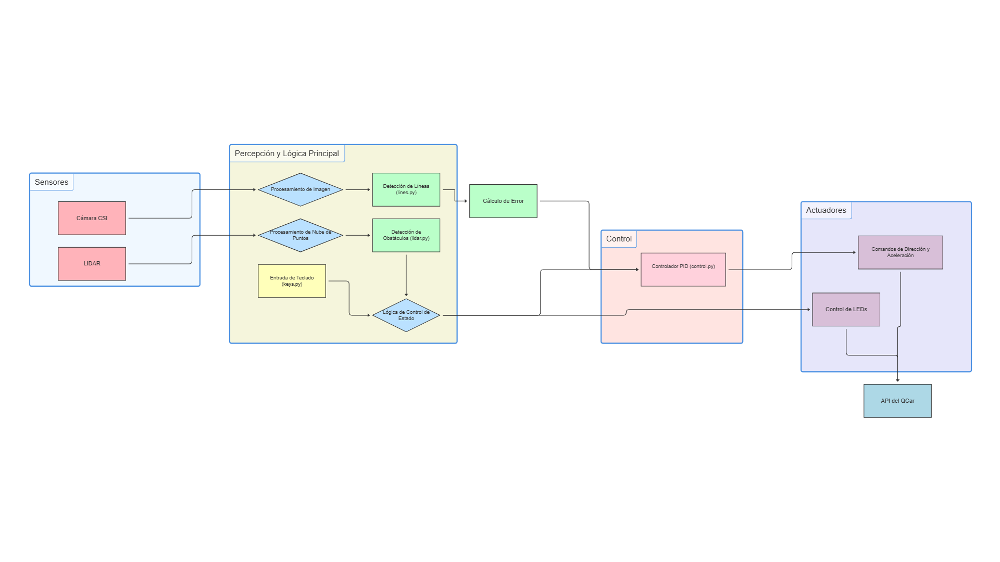

# Proyecto: Seguidor de Líneas con QCar y Evasión de Obstáculos

Este proyecto implementa un sistema de conducción autónoma para un vehículo **Quanser QCar**. El sistema utiliza visión por computadora para detectar y seguir una línea amarilla en el carril, y un sensor LIDAR para detectar y evitar obstáculos, deteniendo el vehículo de forma segura. El control del vehículo se realiza mediante un controlador PID para un seguimiento suave y preciso de la línea.

## Autor

- **José Balbuena**
- **GitHub:** [JoseBalbuena181096](https://github.com/JoseBalbuena181096)

---

## Tabla de Contenidos

- [Demostración en Video](#demostración-en-video)
- [Características Principales](#características-principales)
- [Arquitectura del Sistema](#arquitectura-del-sistema)
- [Flujo de Ejecución](#flujo-de-ejecución)
- [Descripción de Módulos](#descripción-de-módulos)
- [Instalación y Dependencias](#instalación-y-dependencias)
- [Uso](#uso)
- [Licencia](#licencia)

---

## Demostración en Video 📹

Puedes ver el sistema en funcionamiento en el siguiente video. Se muestra al QCar siguiendo el carril de manera autónoma y deteniéndose de forma segura ante un obstáculo.

**[Ver Demostración en YouTube](https://www.youtube.com/watch?v=q8OvF-NepII)**

---

## Características Principales

- **Detección de Carril Robusta**: Utiliza una transformación de perspectiva y umbralización de color adaptativa en el espacio HSV para aislar las líneas del carril.
- **Ajuste Polinomial con RANSAC**: Implementa un algoritmo RANSAC personalizado para ajustar polinomios a los puntos del carril detectados, lo que lo hace resistente a ruido y detecciones anómalas.
- **Control PID**: Un controlador Proporcional-Integral-Derivativo (`PID`) calcula el ángulo de dirección necesario para minimizar el error entre el centro del vehículo y el centro del carril.
- **Evasión de Obstáculos con LIDAR**: Integra un sensor LIDAR para detectar objetos en la trayectoria del vehículo. Si se detecta un obstáculo, el QCar se detiene automáticamente y reanuda la marcha cuando el camino está despejado.
- **Control por Teclado**: Permite al usuario iniciar (`a`), detener (`s`) y salir (`q`) del modo de conducción autónoma de forma interactiva.
- **Visualización en Tiempo Real**: Muestra la imagen de la cámara procesada con superposiciones que indican las líneas detectadas, el centro del carril, el error de seguimiento y el estado del sistema.

---

## Arquitectura del Sistema

El sistema está diseñado de forma modular, donde cada componente se encarga de una tarea específica. Los sensores (Cámara y LIDAR) proporcionan datos al sistema de percepción, que los procesa. El sistema de control toma esta información para tomar decisiones y enviar comandos a los actuadores del QCar.

---

## Flujo de Ejecución

El bucle principal del programa sigue una secuencia lógica para operar el vehículo de forma autónoma, desde la captura de datos hasta la actuación sobre el vehículo.

## 

## Descripción de Módulos

El proyecto se divide en los siguientes archivos Python:

- `LineFollower.py`: Es el **script principal** que orquesta todos los demás módulos. Contiene el bucle principal, gestiona los estados (conducción activa/inactiva, obstáculo detectado) y envía los comandos finales al QCar.

- `lines.py`: Contiene la clase `LaneDetect`. Es el corazón del **sistema de visión por computadora**. Sus responsabilidades incluyen:

  - Realizar la transformación de perspectiva ("vista de pájaro").
  - Aplicar un umbral de color adaptativo para detectar el color amarillo.
  - Calcular un histograma para encontrar la posición inicial de las líneas.
  - Utilizar un método de "ventanas deslizantes" para seguir las líneas a lo largo de la imagen.
  - Ajustar un polinomio de segundo grado a los puntos de la línea usando un algoritmo **RANSAC** para robustez.
  - Calcular el **error** como la distancia entre el centro de la cámara y el centro del carril.

- `control.py`: Define la clase `ControlSystem`. Implementa el **controlador PID** que recibe el error de `LaneDetect` y calcula la salida de control para la dirección. Incluye lógica de anti-windup para el término integral y una función de saturación para limitar los valores de dirección.

- `lidar.py`: Gestiona el sensor **LIDAR**. La clase `LidarProcessor` inicializa el sensor, lee las mediciones de distancia y las procesa para determinar si hay un obstáculo en una región de interés definida delante del coche.

- `camera.py`: Una clase de utilidad (`CameraProcessor`) que encapsula la inicialización y la lectura de frames de la cámara CSI del QCar, simplificando su uso en el script principal.

- `keys.py`: Proporciona una clase `KeyListener` que se ejecuta en un hilo separado para **escuchar las pulsaciones de teclado** de forma no bloqueante, permitiendo el control interactivo del programa.

---

## Instalación y Dependencias

Para ejecutar este proyecto, necesitas tener el entorno de Quanser y las bibliotecas de Python correspondientes instaladas.

1.  **Clonar el repositorio:**

    ```bash
    git clone [https://github.com/JoseBalbuena181096/QCarQuanser.git](https://github.com/JoseBalbuena181096/QCarQuanser.git)
    cd QCarQuanser
    ```

2.  **Dependencias Principales:**
    Asegúrate de tener instaladas las siguientes bibliotecas de Python. Si estás en el entorno QCar, la mayoría ya deberían estar disponibles.

    - `numpy`
    - `opencv-python`
    - `pal.products.qcar`
    - `pal.utilities.lidar`
    - `pal.utilities.vision`

    Puedes intentar instalar las que falten con pip:

    ```bash
    pip install numpy opencv-python
    ```

---

## Uso

1.  Navega al directorio del proyecto en una terminal.
2.  Ejecuta el script principal:
    ```bash
    python3 LineFollower.py
    ```
3.  Aparecerá una ventana mostrando la vista de la cámara.
4.  Usa las siguientes teclas para controlar el programa:
    - **`a`**: Activa el modo de seguimiento de línea. El coche comenzará a moverse.
    - **`s`**: Detiene el modo de seguimiento de línea. El coche se detendrá.
    - **`q`**: Cierra el programa y apaga los sistemas del QCar de forma segura.

---

## Licencia

Este proyecto se distribuye bajo la Licencia MIT. Consulta el archivo `LICENSE` para más detalles.
